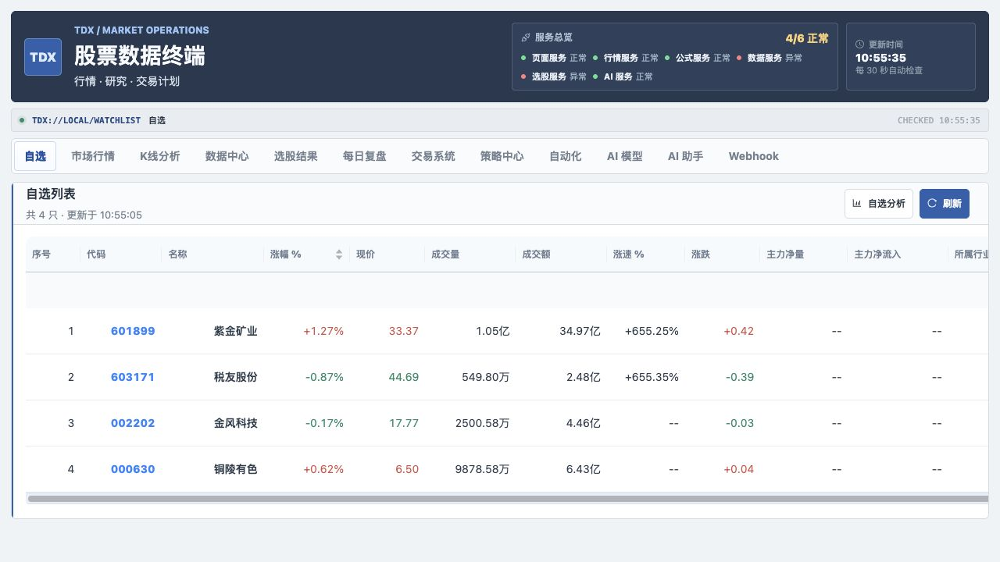
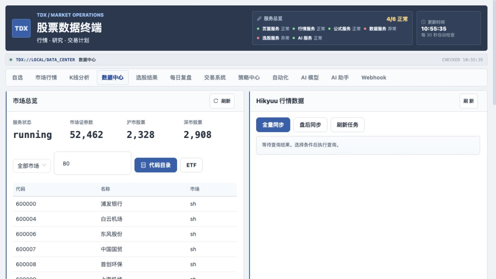
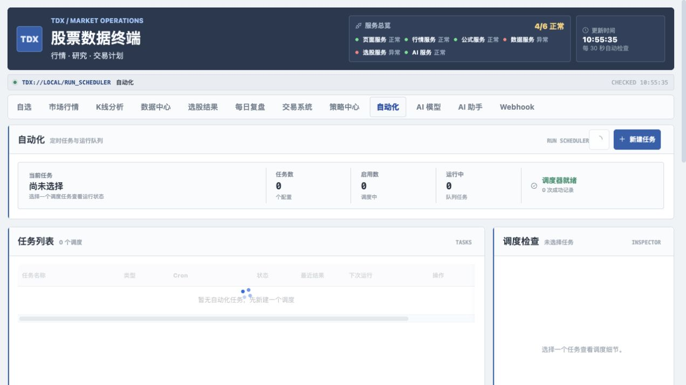
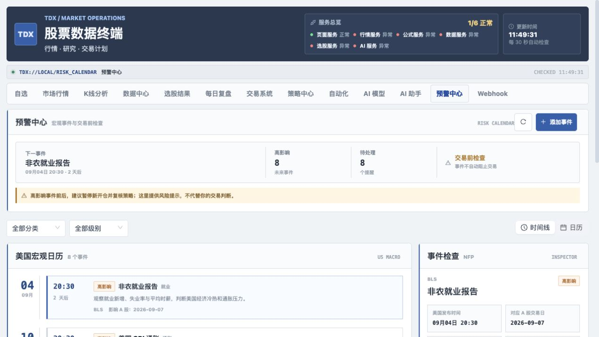
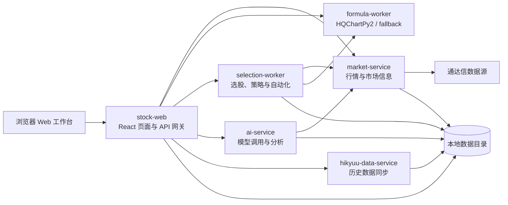

# TDX Workbench

一个本地运行的 A 股行情与交易研究工作台。

TDX Workbench 把通达信行情、历史 K 线、分时、财务、板块、公式、选股、自动化、交易计划和 AI 辅助分析集中到一个 Web 界面中。它适合个人研究、策略验证、盘后复盘和本地数据服务，不定位为交易终端或投资顾问。

> 行情数据可能延迟、缺失或出错。AI 输出仅供学习研究和复盘，不构成投资建议。



## 你可以用它做什么

| 工作区 | 适合做的事 |
| --- | --- |
| 自选 | 查看自选列表、实时行情、五档盘口，并打开个股行情弹窗 |
| 市场行情 | 查看多周期 K 线、分时和自定义指标，支持在 K 线中切换个人公式 |
| K 线分析 | 结合历史 K 线、指标和 AI 做结构化研究 |
| 数据中心 | 查询股票代码、市场概览、财务/F10、股本和收益测算数据 |
| 选股结果与验证 | 浏览公式/策略命中结果，按股票或公式筛选，并跟踪 D1/D5/D10 真实前向表现 |
| 每日复盘 | 沉淀盘后观察、信号和复盘记录 |
| 交易系统 | 记录交易卡、仓位、无效点、计划亏损和复盘内容 |
| 策略中心 | 管理策略规则、执行策略和查看回测/运行结果 |
| 自动化 | 维护股票池，按 Cron 定时运行公式选股或系统同步 |
| 预警中心 | 管理美国宏观事件日历，在 CPI、非农、FOMC、PCE 等数据公布前做交易前检查 |
| AI 模型 | 配置 DeepSeek、OpenAI-compatible、通义千问、智谱 GLM 等模型 |
| AI 研究助手 / AI 选股 | 悬浮问答研究行情；对候选股票做 Hikyuu 验证和 AI 排序 |
| Webhook | 把选股、策略和自动化任务结果发送到外部通知地址 |

## 当前界面预览

### 数据中心



### 自动化任务



### 预警中心



## 快速启动

### Docker Compose

要求：

- Docker Desktop 或 Docker Engine
- Docker Compose v2

在项目根目录执行：

```bash
docker compose up -d --build
```

打开 Web 工作台：

```text
http://localhost:8080
```

检查服务状态：

```bash
docker compose ps
curl http://localhost:8080/api/health
curl http://localhost:8080/api/services/status
```

首次使用 AI 时，进入 `AI 模型` 工作区保存并启用一个模型配置；在 `自选` 工作区点击股票代码打开详情，再点击 `AI 研究报告`。不配置 AI 也可以使用行情、数据、公式和策略功能。

### 常用 Docker 命令

```bash
# 只重建某个服务
docker compose up -d --build stock-web
docker compose up -d --build ai-service

# 查看日志
docker compose logs -f stock-web
docker compose logs -f market-service
docker compose logs -f ai-service

# 停止服务
docker compose down
```

Compose 是完整六服务部署的标准入口。根目录 `Dockerfile` 是早期的单镜像兼容方案，只包含 Web 与公式 worker，不等价于完整 Compose 部署。

## 系统架构



项目采用多服务结构，但仍可以通过一条 Compose 命令启动完整闭环。Go 负责协议、服务 API 和任务调度，Python 负责公式与 Hikyuu 运行时，React 负责工作台 UI。按运行时和故障域拆分是合理的，也便于单独构建、重启和排障；代价是部署、监控与跨服务数据一致性的复杂度更高。

## 服务清单

| 服务 | 目录 | 容器 | 宿主机端口 | 职责 |
| --- | --- | --- | ---: | --- |
| Web 工作台 | `apps/web/` | `tdx-workbench-web` | `8080` | 页面、业务 API 和服务代理 |
| 行情服务 | `services/market-service/` | `tdx-workbench-market` | `18081` | 行情、K 线、分时、成交、代码、财务和板块 |
| 公式引擎 | `services/formula-worker/` | `tdx-workbench-formula` | `18712` | HQChartPy2 或 fallback 公式执行 |
| 指标选股 | `services/selection-worker/` | `tdx-workbench-selection` | `18082` | 股票池、公式选股、策略和自动化任务 |
| AI 分析 | `services/ai-service/` | `tdx-workbench-ai` | `18083` | 模型配置、聊天、单股分析和自选分析 |
| Hikyuu 研究数据 | `services/hikyuu-data-service/` | `tdx-workbench-hikyuu-data` | `18091` | 历史数据、数据质量、统一指标和参考回测 |

正常使用只需要访问 `8080`。其他宿主机端口是排障入口；如果部署在共享网络或公网前面，应通过防火墙、反向代理或仅绑定 `127.0.0.1` 限制访问。

共享代码位于：

```text
packages/tdx-core/        # 通达信协议、数据模型和基础拉取逻辑
packages/workbench-core/  # 公式、股票池、策略、任务和存储模型
```

## 三条核心工作流

### 1. 看行情与做研究

1. 在自选列表中查看实时行情。
2. 点击股票代码或整行，打开行情弹窗。
3. 在分时、日 K、周 K、月 K 等周期之间切换。
4. 点击 K 线上的指标名称，选择自己的自定义指标。
5. 需要时跳转到市场行情或 K 线分析工作区继续研究。

### 2. 公式选股与自动化

1. 在公式管理中创建选股公式或图表指标。
2. 在自动化工作区创建股票池。
3. 选择公式、股票池和执行时间。
4. 手动运行或启用 Cron 调度。
5. 在选股结果中查看命中股票，并回到行情页面复核。

选股结果中心支持按信号后的交易日验证表现。默认以 5 日收盘收益达到 3% 且最大回撤不超过 5% 作为达标标准；达标率只代表历史样本统计，不是未来成功概率。

公式 worker 会优先尝试使用 HQChartPy2；如果扩展不可用或单次执行失败，会回退到内置 Python 执行器。fallback 支持常见的 `MA`、`EMA`、`SMA`、`REF`、`LLV`、`HHV`、`CROSS`、`SUM`、`STD`、`IF`、`MAX` 和 `MIN`。

示例公式：

```text
CROSS(MA(C,5),MA(C,20));
```

### 3. AI 辅助分析

AI 分析不是单独的一套数据源，而是建立在行情服务的结构化上下文之上。

自选分析会按当前自选代码查询：

- 实时行情和五档相关数据
- 近期日 K，默认最多 60 根
- 财务快照
- 本地已采集资讯，默认最多 10 条
- 页面当前已经刷新的行情快照
- 已启用的自定义指标元数据

配置方式：

1. 打开 `AI 模型` 工作区。
2. 新建并启用一个模型配置，API Key 会加密保存。
3. 回到 `自选`，点击股票代码打开详情。
4. 点击 `AI 研究报告`，开始生成带证据链的单股报告。

支持的内置 provider 包括 DeepSeek、OpenAI、通义千问、智谱 GLM 和自定义 OpenAI-compatible 接口。AI 服务会保存分析运行记录，但 API Key 只返回脱敏结果。`AI 选股` 先读取选股结果、股票池或手动代码，再用 Hikyuu MA 交叉参考回测，AI 只负责候选集内排序和解释；历史胜率不代表未来成功概率。

### 4. 宏观事件预警

打开 `预警中心` 可以查看美国宏观数据的发布时间、影响级别和对应 A 股交易日，并在事件前标记为待处理或已处理。首版内置：

- CPI 通胀：观察核心通胀与利率预期变化。
- 非农就业：观察就业新增、失业率和平均时薪。
- 美联储议息会议（FOMC）：关注利率决议、点阵图和发布会。
- PCE 物价指数：关注美联储偏好的通胀指标。

内置日期是可编辑的参考日历。预警中心会按 `MACRO_EVENT_SYNC_INTERVAL` 拉取 BLS、Federal Reserve、BEA 的公开日程；单一来源失败时保留上次成功数据，并在页面标记失败。BLS 可能对云环境返回 HTTP 403，可通过 `MACRO_EVENT_BLS_EMPLOYMENT_URL`、`MACRO_EVENT_BLS_CPI_URL` 配置镜像或代理地址。官方事件会尽量使用行情服务的交易日历计算对应 A 股交易日，无法确认时显示“待交易日历确认”。

提醒规则包含提前提醒、事件前后风险窗口和高影响过滤。默认不会发送 Webhook；在 `提醒规则` 中打开通知并填写渠道 ID JSON 数组后，系统才会发送 `macro_event.alert_due` 和 `macro_event.window_started`，每个事件、渠道和提醒类型只发送一次。预警中心会统计当前持仓和观察池关联的风险事件，交易系统也会显示同一风险窗口。它只提供复核提示，不会自动阻止交易，也不构成投资建议。事件模型还支持手动添加中国 CPI、PMI、社融、LPR，以及政策、财报和解禁等分类。

## 数据与持久化

Docker Compose 会把项目中的 `data/` 挂载到容器。重建镜像不会主动清空这些数据。

常见数据包括：

```text
data/
├── database/                 # SQLite、行情和工作台数据
├── hikyuu/stocks/            # Hikyuu 历史数据
├── hikyuu/config/            # Hikyuu 配置
├── hikyuu/logs/              # 同步日志
└── ...                       # 运行快照和任务结果
```

建议把 `data/` 纳入本地备份范围，不要在没有备份的情况下删除它。

## 配置要点

Compose 已经提供了服务间默认地址。需要长期使用或部署到其他环境时，建议在 `.env` 或部署环境中显式设置：

| 变量 | 用途 |
| --- | --- |
| `AI_CREDENTIAL_SECRET` | 加密保存 AI 凭据的密钥 |
| `AI_SERVICE_TOKEN` | Web 与 AI 服务之间的访问令牌 |
| `DEEPSEEK_API_KEY` | 通过环境变量提供 DeepSeek API Key |
| `DEEPSEEK_BASE_URL` | DeepSeek 接口地址，默认 `https://api.deepseek.com` |
| `MARKET_SERVICE_URL` | AI 服务访问行情服务的地址 |
| `HIKYUU_DATA_SERVICE_URL` | AI 研究报告访问 Hikyuu 元数据、质量和指标的地址 |
| `FORMULA_WORKER_URL` | Web/选股服务访问公式 worker 的地址 |
| `MARKET_SYNC_ON_START` | 行情服务启动时是否同步基础代码和交易日 |
| `AUTOMATION_SCHEDULER_ENABLED` | 是否启用自动化调度 |
| `MACRO_EVENT_SYNC_ENABLED` | 是否启用宏观日历自动同步，默认启用 |
| `MACRO_EVENT_SYNC_INTERVAL` | 宏观日历同步间隔，例如 `12h`，默认 `12h` |
| `MACRO_EVENT_BLS_EMPLOYMENT_URL` | 非农官方页面地址，必要时配置镜像或代理 |
| `MACRO_EVENT_BLS_CPI_URL` | CPI 官方页面地址，必要时配置镜像或代理 |
| `MACRO_EVENT_FOMC_URL` | Federal Reserve 议息日历地址 |
| `MACRO_EVENT_BEA_URL` | BEA 发布日程地址 |

通过环境变量提供的 AI 凭据会以 `env:` 开头显示，并且不能从页面删除。长期部署时请固定 `AI_CREDENTIAL_SECRET`，否则更换密钥后历史凭据可能无法解密。

默认 Compose 配置面向本机试用：`AI_SERVICE_TOKEN` 为空、后端调试端口对宿主机开放，且 `AI_CREDENTIAL_SECRET` 有开发默认值。生产或共享网络使用前，必须改成强随机密钥、设置服务令牌，并收紧端口暴露。

## 常用 API

Web 工作台默认代理以下常用接口：

```bash
# 实时行情
curl "http://localhost:8080/api/quote?code=000001"

# 历史 K 线
curl "http://localhost:8080/api/kline-history?code=000001&type=day&limit=120"

# 标准分析上下文
curl "http://localhost:8080/api/analysis/context?codes=000001,600519&kline_limit=60&news_limit=10"

# 公式健康状态
curl "http://localhost:8080/api/formula/health"

# AI provider 列表
curl "http://localhost:8080/api/ai/providers"

# 宏观事件日历
curl "http://localhost:8080/api/macro-events?category=inflation&impact=high"

# 查看官方日程同步状态
curl "http://localhost:8080/api/macro-events/sync"

# 手动同步官方日程
curl -X POST "http://localhost:8080/api/macro-events/sync"

# 读取预警窗口与持仓/观察池联动摘要
curl "http://localhost:8080/api/macro-events/overview"

# 保存提醒规则（默认 webhook_ids 为空，不发送外部通知）
curl -X PUT "http://localhost:8080/api/macro-events/settings" \
  -H "Content-Type: application/json" \
  -d '{"enabled":true,"lead_minutes":240,"window_before_minutes":240,"window_after_minutes":120,"critical_only":true,"notify_webhooks":true,"webhook_ids":"[\"your-webhook-id\"]"}'
```

AI 分析接口示例：

```bash
curl -X POST "http://localhost:8080/api/ai/analyze/stock" \
  -H "Content-Type: application/json" \
  -d '{"provider":"deepseek","symbol":"603171"}'
```

```bash
curl -X POST "http://localhost:8080/api/ai/analyze/watchlist" \
  -H "Content-Type: application/json" \
  -d '{"provider":"deepseek","pool_id":"watchlist","symbols":["601899","603171"]}'
```

单股 AI 研究报告（包含证据链、数据质量和版本信息）：

```bash
curl -X POST "http://localhost:8080/api/ai/research/stock" \
  -H "Content-Type: application/json" \
  -d '{"provider":"deepseek","symbol":"603171","input":{"name":"税友股份","source":"watchlist"}}'
```

完整参数、响应格式和错误码见 [API 参考](docs/api-reference.md)。

## 源码运行

要求：

- Go 1.23+
- Python 3.11+
- Node.js 18+
- SQLite
- 如果需要完整公式能力，准备 HQChartPy2 构建环境

推荐优先使用 Docker。源码开发时先构建 React 前端：

```bash
cd apps/web/frontend
npm ci
npm run build
```

构建产物会写入 `apps/web/static-react/`。然后分别启动依赖服务：

下面每组命令都应在独立终端中运行；这些服务启动后会持续占用当前终端。

```bash
python3 services/formula-worker/worker.py
(cd services/market-service && go run .)
(cd services/selection-worker && go run .)
(cd services/ai-service && go run .)
(cd apps/web && go run .)
```

Hikyuu 服务需要先安装 `services/hikyuu-data-service/requirements.txt` 和 `hikyuu==2.8.2`，再从该目录运行 `uvicorn app:app --host 0.0.0.0 --port 8091`。

Hikyuu 在本项目中的职责边界是：负责可复现的历史研究数据、指标和参考回测；TDX
负责实时行情；Go 负责业务编排。数据同步成功后会生成 `data_revision`，指标和
回测结果都会返回该修订号。策略中心中的“回测”默认使用 Go 引擎，“Hikyuu 校验”
显式调用 Hikyuu MA 交叉参考策略，不能把两者结果混用。

源码模式下，如需让 Web 走独立行情、公式和 AI 服务，请显式设置服务地址：

```bash
cd apps/web
MARKET_SERVICE_URL=http://localhost:8081 \
FORMULA_WORKER_URL=http://localhost:8712 \
AI_SERVICE_URL=http://localhost:8083 \
go run .
```

如果 `8080` 已被占用：

```bash
cd apps/web
PORT=18080 go run .
```

## 开发验证

根目录是多模块 `go.work` 工作区，不能用根目录的 `go test ./...` 代替模块级测试。

```bash
# Compose 配置
docker compose config --quiet

# JavaScript 语法
node --check apps/web/static/app.js

# Go 模块测试
for module in \
  packages/tdx-core \
  packages/workbench-core \
  apps/web \
  services/market-service \
  services/selection-worker \
  services/ai-service; do
  (cd "$module" && go test ./...)
done

# React 前端
(cd apps/web/frontend && npm ci && npm run build)
```

`apps/web/static-react/` 是 Docker 镜像直接提供的构建产物。修改 `frontend/src/` 后要重新构建并提交产物，或在 CI 中完成这一步。

服务状态检查：

```bash
docker compose ps
curl http://localhost:8080/api/services/status
```

## 项目结构

```text
tdx-api/
├── apps/web/                    # Web 页面、API 网关和工作台后端
│   └── frontend/                # React + Vite 源码
├── services/
│   ├── market-service/          # 独立行情服务
│   ├── formula-worker/          # 公式执行服务
│   ├── selection-worker/        # 选股、策略和自动化服务
│   ├── ai-service/              # AI 模型与分析服务
│   └── hikyuu-data-service/     # Hikyuu 数据服务
├── packages/
│   ├── tdx-core/                # 通达信核心库
│   └── workbench-core/          # 工作台共享模型和存储
├── data/                        # SQLite、Hikyuu 数据和任务快照
├── docs/                        # 使用、部署、API 和算法文档
├── scripts/                     # 示例脚本和日常工具
├── docker-compose.yml           # 完整多服务部署入口
└── go.work                      # Go 多模块工作区
```

## 文档导航

| 文档 | 内容 |
| --- | --- |
| [Web 使用指南](docs/web-guide.md) | 页面入口、功能区域和操作流程 |
| [部署指南](docs/deployment-guide.md) | Docker、本地运行、验证和排障 |
| [API 参考](docs/api-reference.md) | REST API 参数、响应和示例 |
| [交易系统说明](docs/TRADING_SYSTEM_V1.md) | 交易卡、仓位和复盘规则 |
| [除权除息与复权算法](docs/gbbq-adjustment.md) | gbbq 数据结构和复权计算 |
| [文档历史](docs/document-history.md) | 阶段性文档的整理记录 |

## 开源组件与致谢

本项目在以下开源项目或协议库的基础上进行集成和扩展：

| 项目 | 用途 |
| --- | --- |
| [oficcejo/tdx-api](https://github.com/oficcejo/tdx-api) | 原始项目基础 |
| [injoyai/tdx](https://github.com/injoyai/tdx) | 通达信协议库 |
| [jones2000/HQChart](https://github.com/jones2000/HQChart) | K 线与专业行情展示 |
| [jones2000/hqchartPy2](https://github.com/jones2000/hqchartPy2) | 公式计算引擎 |
| [fasiondog/hikyuu](https://github.com/fasiondog/hikyuu) | 历史行情数据管理、同步与技术分析框架 |

具体许可信息和第三方代码说明以各项目仓库及本仓库内的许可证文件为准。

## 免责声明

本项目仅用于学习、研究、数据整理和策略验证。项目作者不对行情准确性、数据连续性、策略结果、AI 输出或任何投资决策造成的损失负责。使用本项目连接第三方模型或数据服务时，请自行确认对应服务的隐私、计费和使用条款。
